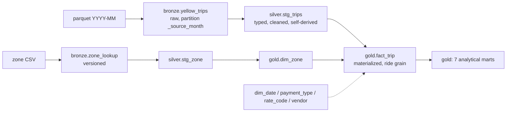

# NYC Yellow Taxi Analytics on GCP

**Take-home submission.** A cost-optimized, **incremental**, production-shaped data
pipeline that ingests NYC Yellow Taxi trip data, cleans + enriches it into a
dimensional model, and answers one question:

> **If you were advising a new taxi driver on how to maximize earnings, what would you tell them?**

Built entirely on **GCP**, defined with **Terraform**, transformed with **Dataform**,
and designed to scale from one month to **5 years of monthly data on a daily
schedule** for **≈ $0–$2/month**.

This README is the main deliverable — it answers each requirement from the brief in
order (services & why, cost, data model, pipeline design, data quality, findings).
For a component-by-component teaching walkthrough, see [docs/LESSONS.md](docs/LESSONS.md).

---

## TL;DR — the advice to the driver

Backed by 7 months of 2023 data (**21.96M valid trips**), full detail in
[§6](#6-findings--advice-to-the-driver) and charted in
[`analysis/driver_earnings_analysis.ipynb`](analysis/driver_earnings_analysis.ipynb):

1. **Drive early morning & late evening, not the midday rush.** Weekday **4–5am ≈ $115/occupied-hr** vs **~$76 at 3pm** — because median speed collapses from ~19 mph to ~8 mph. *The busiest hours pay the least per hour.*
2. **Take the airport runs.** A **JFK pickup ≈ $77** and holds **~$108/hr**; **LaGuardia ≈ $109/hr** — vs **~$83/hr** for a normal trip, even after the empty return.
3. **Quick hops or long hauls — skip the 2–5 mi dead zone.** $/hr is U-shaped: **<1 mi ≈ $97/hr** (and best $/mile), **20+ mi ≈ $112/hr**, but **2–3 mi ≈ $76/hr** (worst).
4. **Expect tips only from card riders (~22%); cash reads $0.** Cash tips are never recorded — don't judge riders or zones on cash data. Best-tipping zones are Manhattan (Upper East/West Side, ~24%).
5. **Position around the Queens airports and Lower/Upper Manhattan** (~$88–110/hr), and remember **~89% of drop-offs are in Manhattan** — most trips self-replenish, but Staten Island / Bronx / Newark drop-offs risk an empty drive back.

---

## 1. GCP services used — and why (cost reasoning)

The workload is **tiny** (~50 MB / ~3M rows per month; ~3 GB / 180M rows over 5
years). Every choice below optimizes for **near-zero cost at this scale** while
staying production-robust. The guiding principle: **ELT — load raw, transform in
the warehouse — so there is no compute cluster to pay for.**

| Layer | Service | Why this over the alternatives | Cost here |
| --- | --- | --- | --- |
| Raw storage | **Cloud Storage** | Regional bucket co-located with BigQuery so **loads are free**; immutable source-of-truth files. | ~$0.06/mo |
| Warehouse + compute | **BigQuery** | Serverless, pay-per-query, **1 TiB/mo free**. No cluster to size or pay for while idle. Doubles as the catalog. | ~$0 (free tier) |
| Ingest | **Cloud Run Job** | Run-to-completion batch download+load. A **Cloud Function** has tighter timeout/size limits; **Dataflow** would spin up worker VMs for a 50 MB download. Billed only for the ~2 min/day it runs. | ~$0 (free tier) |
| Transforms | **Dataform** (run in a Cloud Run job) | GCP-native, **free**, gives a dependency **DAG + incremental tables + built-in data-quality assertions**. **dbt Core** would need a runner to host; **scheduled queries** have no DAG/tests/lineage. | ~$0 |
| Orchestration | **Cloud Workflows** | Serverless state machine, free at this volume. **Cloud Composer/Airflow** carries a **~$300–500/mo standing footprint** even when idle — 100× the entire bill. | ~$0 |
| Schedule | **Cloud Scheduler** | Managed cron; 3 jobs free. | $0 |
| IaC | **Terraform** | Best GCP provider support; the whole stack is reproducible from code. | — |
| Image build / registry | **Cloud Build + Artifact Registry** | Build images in-cloud (no local Docker); store the ingest + transform images. | ~$0 |

**Explicitly rejected as overkill (and why):**
- **Dataflow (Apache Beam)** and **Dataproc (Spark)** spin up **paid worker VMs** to
  do what a free `bq load` + SQL `MERGE` does at this volume. They earn their keep
  at 100s of GB–TB per run or for true streaming — here they are pure cost.
- **Cloud Composer (Airflow)** — its standing GKE + Cloud SQL footprint dwarfs the
  whole pipeline; the DAG here (ingest → maybe-transform) is simple enough for
  Cloud Workflows.
- **Streaming inserts** — batch loads from GCS are **free**; streaming bills per
  byte. We never stream.

## 2. Cost estimate (production: 5 years, daily runs)

**≈ $0–$2 / month.** Everything fits GCP's Always-Free tier except a sliver of
BigQuery storage.

| Service | Basis | Monthly |
| --- | --- | --- |
| BigQuery **query** | A new month's transform scans ~1 partition (~0.2 GB); the monthly gold rebuild scans silver (~0.03 TiB). ≪ 1 TiB free. | **$0.00** |
| BigQuery **storage** | ~60 GB logical − 10 GB free, mostly long-term. | **~$0.5–1** (logical) / **~$0** (physical/compressed billing) |
| Cloud Storage | ~3 GB of parquet @ $0.020/GB | **~$0.06** |
| Cloud Run Jobs | ~30 runs × ~2 min — under the free tier | **$0.00** |
| Cloud Workflows | ~30 runs × ~20 steps ≪ 5,000 free | **$0.00** |
| Cloud Scheduler | 1 job (3 free) | **$0.00** |

*2026 rates (us-central1): BigQuery on-demand **$6.25/TiB** (1 TiB/mo free); storage
$0.02 active / $0.01 long-term (10 GiB free); **batch load from GCS is free**.* The
one-time 5-year backfill is also effectively free — loads cost $0 and scanning
~30 GB a handful of times is a rounding error against the 1 TiB/month allowance.
Full breakdown: [docs/cost_estimate.md](docs/cost_estimate.md).

**How the design keeps cost near zero:** (1) load, don't stream; (2) transform in
BigQuery, no VMs; (3) partition + cluster so reads touch only the new month; (4)
**gate the transforms** so they run only when a new month lands (~29/30 daily runs
are no-ops); (5) single region (free loads, no egress); (6) `require_partition_filter`
guards against an accidental full-table scan.

## 3. Data model (bronze → silver → gold star schema)

Medallion layers with a **Kimball star** in gold. All datasets/tables/columns are
**snake_case**. Full schema + contract: [docs/data_model.md](docs/data_model.md).



- **Bronze** — raw rides, faithful copy (names conformed to snake_case at load),
  partitioned by file month for idempotent reloads. `zone_lookup` is a **versioned**
  native table (hash-based: one snapshot per real change).
- **Silver** — *conformed staging*: each source cleaned **independently**, row-level,
  self-derived (`driver_revenue`, `earnings_per_hour`, `tip_pct`, hour/day-of-week…).
  Keeps zone/code **FK** columns — **no cross-table joins here**.
- **Gold** — a **Kimball star**: `fact_trip` (materialized, ride grain — BI/notebook
  plugs in here) + 5 conformed dimensions + 7 analytical marts. Integration (joins)
  happens at this layer.

*Why medallion + star:* the layers keep responsibilities separate (bronze = replay
buffer, silver = clean events, gold = business model), and the star is the natural,
cheap-to-scan shape for analytics (tiny integer FKs in the fact, labels in the dims).

## 4. Pipeline design — how it works, how to run it, what makes it robust

**Flow (daily):** Cloud Scheduler → Cloud Workflows → Cloud Run **ingest** → *(if a
new month landed)* → Cloud Run **transform** (`dataform run`: silver + gold +
assertions).

**What makes it robust:**
- **Incremental + idempotent** — bronze replaces one month's partition inside a
  single BigQuery transaction; silver/fact `MERGE` on `trip_sk`. Reprocess a month
  safely; never reprocess old data.
- **Gated transforms** — the expensive SQL runs only when the ingest state file
  reports a genuinely new month, so ~29/30 daily runs are near-free no-ops.
- **Schema-drift tolerant** — the ingest builds the bronze INSERT dynamically from
  each file's real columns (handles missing `airport_fee`/`congestion_surcharge` in
  old years, INT↔FLOAT drift, and the `Airport_fee` casing quirk).
- **Self-healing backfill** — if the source delays and later publishes several
  months at once, the ingest loads the *oldest unloaded* month each run, filling
  gaps one month/day; a permanently-missing month is skipped, never blocking newer ones.
- **Data quality as a gate** — Dataform assertions fail the run on bad data (see §5).
- **Least privilege** — four scoped service accounts; no broad roles.

### Deploy (needs your GCP auth/billing)

```bash
gcloud auth login
bash scripts/bootstrap.sh                          # project, billing, minimal APIs, TF-state bucket, ADC
cd terraform
cp terraform.tfvars.example terraform.tfvars       # set project_id, region
terraform init -backend-config="bucket=<PROJECT_ID>-tfstate" -backend-config="prefix=taxi/state"
terraform apply -target=google_artifact_registry_repository.taxi   # repo first
bash ../scripts/build_push.sh <PROJECT_ID> us-central1             # push ingest + transform images
terraform apply                                                     # everything else
gcloud workflows run taxi-pipeline --location us-central1 --data '{"target_month":"2023-01"}'  # one month
bash scripts/backfill.sh <PROJECT_ID> us-central1 2019-01 2023-12  # 5-year backfill (one workflow run/month)
```

> **Transforms run in a container**, not managed Dataform-from-Git: the `dataform/`
> project is bundled into the `taxi-transform` Cloud Run job (image built by
> `build_push.sh`), which runs `dataform run` as `sa-taxi-dataform`. This keeps the
> whole pipeline in one monorepo (managed Dataform requires the project at a git
> repo root). The workflow triggers it only when a new month lands.

### Verify locally (no cloud cost)

```bash
cd ingest && python -m pytest -q            # unit tests (pure logic, no cloud)
cd ../terraform && terraform validate
cd ../dataform && npx @dataform/cli@3.0.0 compile
# cross-layer reconciliation against live BigQuery:
PROJECT_ID=<proj> python tests/data_quality_checks.py
```

## 5. Data quality issues found & handled

From 7 months of 2023 (**22,400,728 raw → 21,960,301 valid, ~2.0% dropped**):

| Issue | Prevalence | Handling |
| --- | --- | --- |
| **Cash tips never recorded** (payment_type=2 tip ≈ $0) | 17.1% of trips | Restrict tip analysis to **card**; documented as the headline trap. |
| `trip_distance` ≤ 0 | 1.43% | Kept, but excluded from per-mile metrics via `SAFE_DIVIDE`. |
| Negative fare / total amounts | 0.91% | Dropped. |
| `passenger_count` null cohort (a distinct provider batch: also payment_type=0, `airport_fee` null) | 2.74% | Kept as "Unrecorded"; coalesce fees to 0. |
| `RatecodeID` = 99 (undocumented) | 110,397 rows | Kept, treated as unknown. |
| `dropoff ≤ pickup` / duration > 12 h | 0.039% / small | Dropped. |
| Sub-minute "trips" (meter errors) incl. **spurious Newark pickups** (yellow cabs can't pick up in NJ) | small | Dropped (`trip_minutes >= 1`); Newark-pickup rows are an artifact. |
| Stray out-of-month timestamps (pickups back to 2008) | 537 rows | Filter silver to the file's month via `_source_month`. |
| **Schema drift across years** (missing cols, INT/FLOAT, `Airport_fee` casing) | all years | Dynamic unified load in the ingest job. |
| Zone IDs 264/265 = Unknown / Outside-NYC | reference | Excluded from zone rankings & marts. |
| **`AVG(tip/fare)` inflated by tiny fares** — a $0.01 fare with a normal tip = a 10,000% ratio; 73 such trips averaged 335,862% | rare but distorting | Aggregate tip rate as **pooled `SUM(tip)/SUM(fare)`**, not average-of-ratios (a bug a single clean month hid). |
| Timestamps are **local NYC wall-clock**, not UTC | all | No timezone conversion → hour-of-day advice is genuinely local. |

**Tested two ways:** (1) **Dataform assertions** gate every transform run (unique
key, row-conditions, and a gold-sanity check that fails the run if any zone/hour
slot has an impossible $/hr). (2) A standalone cross-layer reconciliation suite,
[`tests/data_quality_checks.py`](tests/data_quality_checks.py), proves bronze ↔
silver ↔ gold tie out exactly. **Latest run: all 10 checks pass** (bronze 2023-01 ==
3,066,766 source rows; bronze valid-rows == silver rows per month; silver keys 100%
unique with 0 formula/range violations; `fact_trip` == silver grain; marts reconcile
to the fact).

## 6. Findings — advice to the driver

All figures are 7 months of 2023 (21.96M valid trips); `$/hr` = **median driver
revenue (fare + tip) per occupied hour** — a ranking signal, not take-home wage
(it excludes idle/cruising time). Charts:
[`analysis/driver_earnings_analysis.ipynb`](analysis/driver_earnings_analysis.ipynb);
raw SQL + results: [`analysis/queries.sql`](analysis/queries.sql); deeper narrative:
[docs/findings.md](docs/findings.md).

**1. When to drive — the rush-hour paradox.** Peak *demand* is peak *traffic*, which
is worst *pay*:

| Weekday hour | median $/hr | median mph |
| --- | --- | --- |
| 4 am | **$115** | 18.8 |
| 5 am | $114 | 17.4 |
| 9 am | $79 | 8.6 |
| 3 pm | **$76** | 8.2 |
| 11 pm | $93 | 12.6 |

Early mornings and late evenings pay ~50% more per hour than the 9am–3pm crawl.

**2. Take the airport run.** Per-trip *and* per-hour, airports beat the city — even
after a likely empty return:

| Segment | trips | median $/trip | median $/hr | card tip % |
| --- | --- | --- | --- | --- |
| JFK pickup | 1.12M | $77.00 | $108 | 18.5% |
| LaGuardia pickup | 0.74M | $50.80 | $109 | 23.4% |
| Non-airport | 20.1M | $15.30 | $83 | 23.0% |

**3. Short hops or long hauls — avoid the 2–5 mi dead zone.** $/hr is U-shaped:

| Distance | median $/hr | median $/mile |
| --- | --- | --- |
| 0–1 mi | $97 | **$12.47** |
| 1–2 mi | $81 | $9.24 |
| 2–3 mi | **$76** (worst) | $7.73 |
| 3–5 mi | $77 | $6.70 |
| 5–10 mi | $94 | $5.46 |
| 10–20 mi | $107 | $4.78 |
| 20+ mi | **$112** (best) | $4.07 |

**4. Tips come from cards, not cash.** Card riders tip **~22%** (pooled) and 95.5% of
card trips leave a tip; cash records **$0** (unrecorded). Best-tipping pickup zones
(card only) are Manhattan: **Upper East Side South 24.7%**, Upper West Side South
24.5%, Lincoln Square 24.3%, Midtown Center 23.9%.

**5. Where to position.** Highest median $/hr among high-volume zones: **East
Elmhurst / LaGuardia / JFK (Queens, ~$108–110/hr)**, then Manhattan **Yorkville
(~$90–92), Battery Park City, Financial District, Upper West Side (~$88)**.

**6. The empty-return angle (a "huh").** **~89% of drop-offs are in Manhattan** (5%
Queens, 4% Brooklyn) — so most trips self-replenish near demand. The risk is the
tail: Staten Island, far Bronx, and **Newark (EWR)** drop-offs pay well but likely
mean a dead-mile drive back — factor the return leg into "is it worth it."

---

## Repository layout

```
terraform/    IaC: GCS, BigQuery, IAM, Cloud Run, Workflows, Scheduler
ingest/       Cloud Run Job (Python): download → GCS → free BQ load → bronze  (+ pytest)
dataform/     SQL transforms: sources / staging(silver) / dimensions + facts + marts(gold) / assertions
workflows/    pipeline.yaml — the orchestrator
analysis/     queries.sql (results) · driver_earnings_analysis.ipynb (charts) · requirements.txt
tests/        data_quality_checks.py — cross-layer reconciliation
scripts/      bootstrap.sh · build_push.sh · backfill.sh
docs/         LESSONS.md · architecture.md · data_model.md · cost_estimate.md · findings.md
```

## Deliverables checklist (from the brief)

- [x] **Pipeline code** (ingest → clean → enrich) — `ingest/`, `dataform/`, `workflows/`
- [x] **Data model diagram** (layers + schema) — [docs/data_model.md](docs/data_model.md)
- [x] **Analytical queries with results** — [analysis/queries.sql](analysis/queries.sql) + [notebook](analysis/driver_earnings_analysis.ipynb)
- [x] **README** with services & why, cost estimate, data model, pipeline design, data quality, findings — this file
