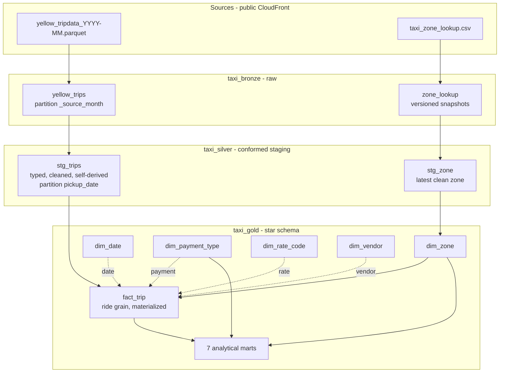

# Data model

Medallion layers, with a **Kimball star schema** in gold. All datasets, tables,
and columns are **snake_case**; the bronze layer keeps the source's raw values
but conforms names at load.

## Layer contract

| Layer | Principle |
|---|---|
| **bronze** | Raw, as-loaded. Faithful copy of the source values; names conformed to snake_case at load, nothing else changed. |
| **silver** | Type-conformed staging — each source cleaned **independently**, row-level, columns derived from the row itself. **No cross-table joins.** |
| **gold** | The business model: conformed **dimensions + a fact**, then analytical **marts** built on top. Integration (joins) happens here. |

## Bronze — `taxi_bronze`

- **`yellow_trips`** — one row per ride, snake_case, unified drift-tolerant schema. Partitioned by `_source_month` (one partition per file → idempotent reload). Source CamelCase (`VendorID`, `PULocationID`, `tpep_pickup_datetime`) is mapped to `vendor_id`, `pu_location_id`, `pickup_datetime` at ingest.
- **`zone_lookup`** — native, **versioned** reference: `location_id, borough, zone, service_zone` + `_content_hash / _snapshot_date / _loaded_at`. The ingest appends a new snapshot only when the CSV's md5 changes (one row-set per real change).

## Silver — `taxi_silver`

- **`stg_trips`** — one row per **valid** ride (invalid rows dropped, see README §Data quality). Typed + self-derived: `trip_sk` (unique key), `pickup_date/hour/dow/dayname`, `is_weekend`, `trip_minutes`, `mph`, `driver_revenue` (= fare + tip), `earnings_per_hour`, `tip_pct`, `is_card`, `is_congestion_zone`. Keeps `pu_location_id`/`do_location_id` and code columns as **FKs** — no zone join here. Incremental, partitioned by `pickup_date`, clustered by `pu_location_id, payment_type`.
- **`stg_zone`** — the latest cleaned zone snapshot + `is_airport`.

## Gold — `taxi_gold` (star schema)

**Fact**
- **`fact_trip`** — materialized, ride-grain. FK keys (`pu_location_id`, `do_location_id`, `vendor_id`, `rate_code_id`, `payment_type`, `pickup_date`) + measures (`fare_amount … total_amount`, `driver_revenue`, `earnings_per_hour`, `tip_pct`, `trip_minutes`, `mph`, `trip_distance`) + degenerate dims (`pickup_hour`, `pickup_dow`, `is_weekend`) + airport flags resolved from `dim_zone`. Partitioned by `pickup_date`. **This is what BI plugs into.**

**Dimensions**
| Dim | Key | Attributes |
|---|---|---|
| `dim_zone` | `location_id` | borough, zone, service_zone, is_airport, airport_name |
| `dim_date` | `date_key` | year, quarter, month, month_name, day_of_week, day_name, is_weekend |
| `dim_payment_type` | `payment_type` | payment_method |
| `dim_rate_code` | `rate_code_id` | rate_code_desc |
| `dim_vendor` | `vendor_id` | vendor_name |

**Marts** (aggregations on `fact_trip` + dims, the "answers"):
`zone_hour_earnings`, `best_slots`, `tipping_by_payment`, `top_tip_zones`,
`airport_economics`, `trip_length_economics`, `hourly_pulse`.
See `analysis/queries.sql` and `docs/findings.md`.
